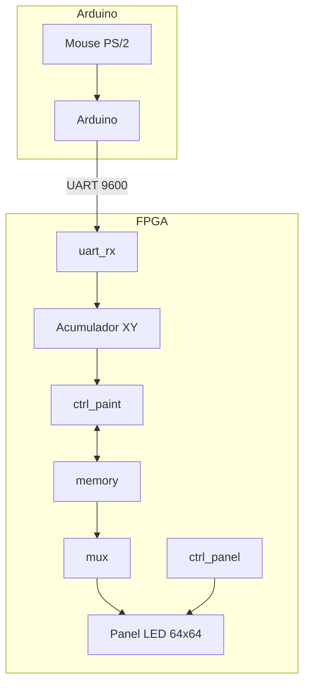
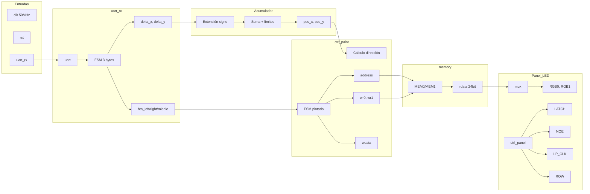
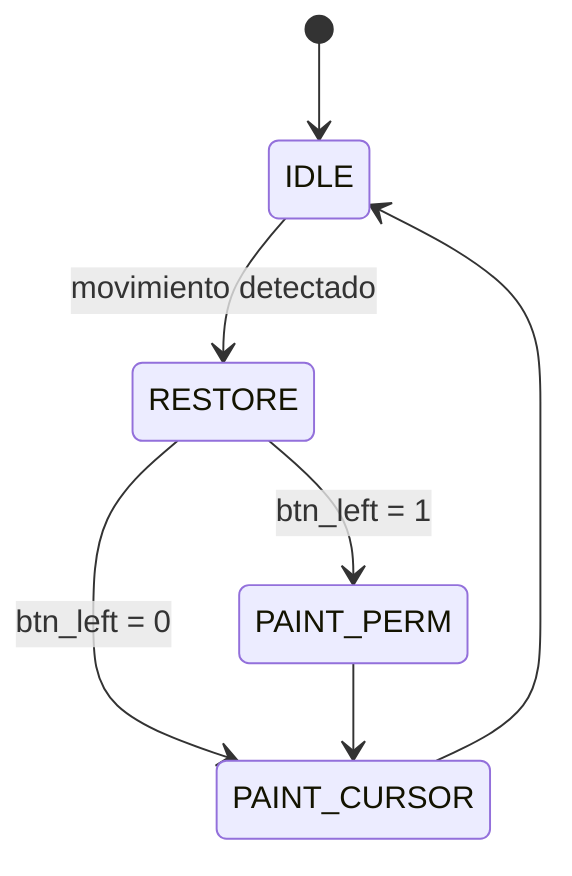
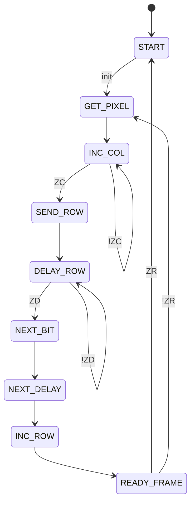
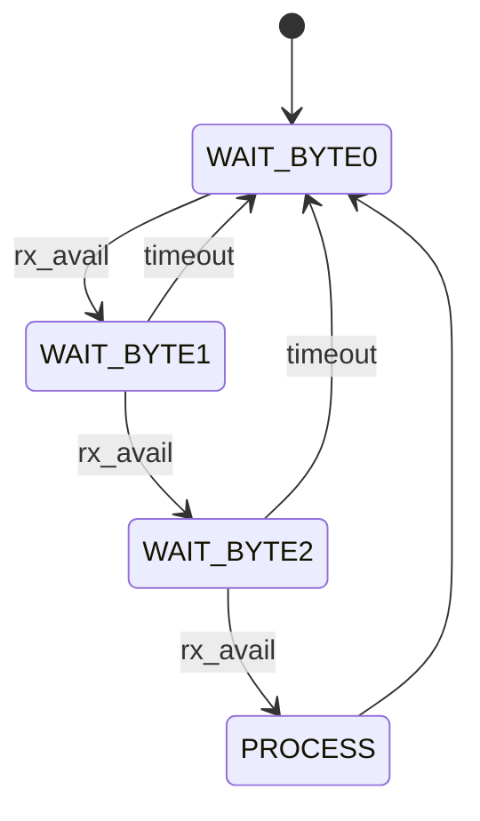
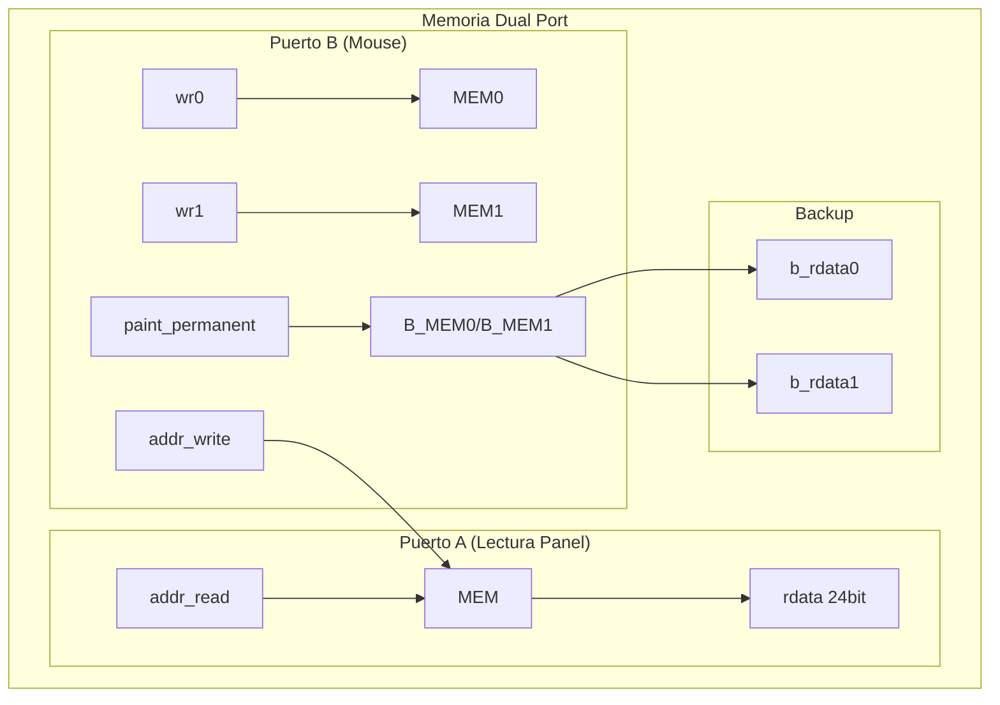
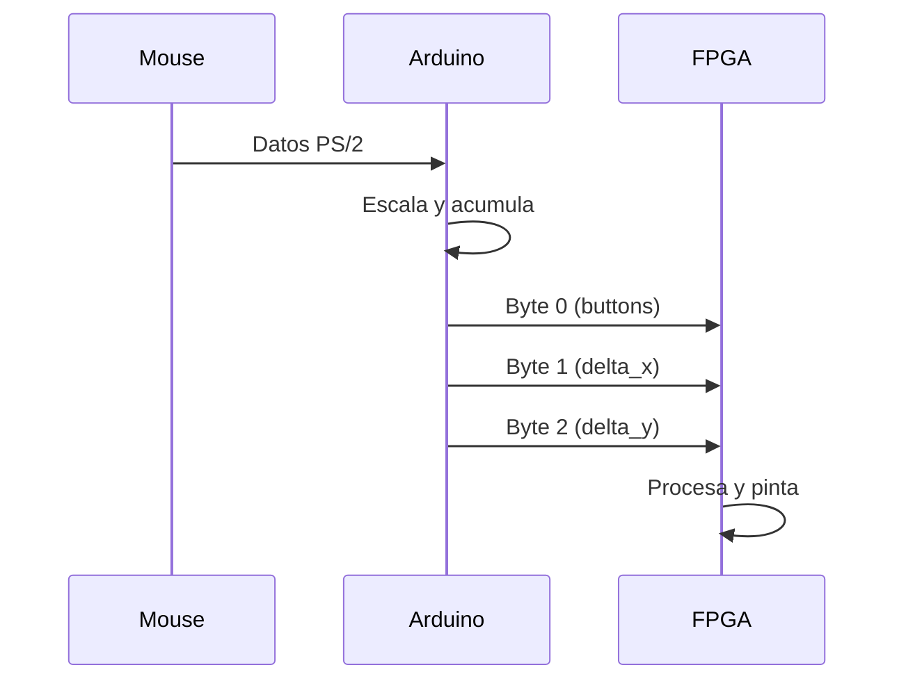

# Diagramas del Sistema

## Arquitectura General

## Diagrama de Bloques - paint_top

## FSM - ctrl_paint

| Estado | Acción |
|--------|--------|
| IDLE | Espera movimiento |
| RESTORE | Restaura píxel anterior desde backup |
| PAINT_PERM | Pinta permanente (escribe en MEM y B_MEM) |
| PAINT_CURSOR | Pinta cursor temporal |

## FSM - ctrl_panel

## FSM - uart_rx

## Diagrama de Memoria

## Protocolo UART

